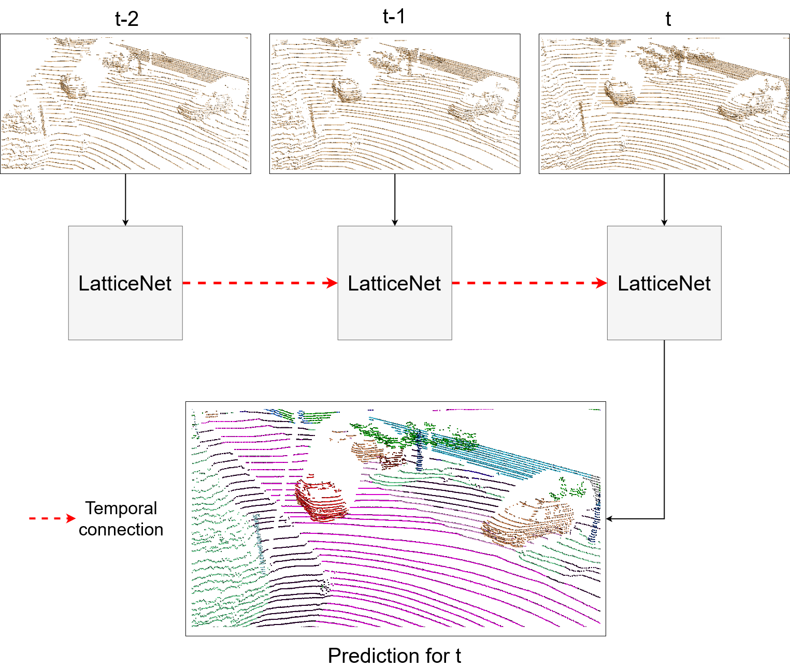
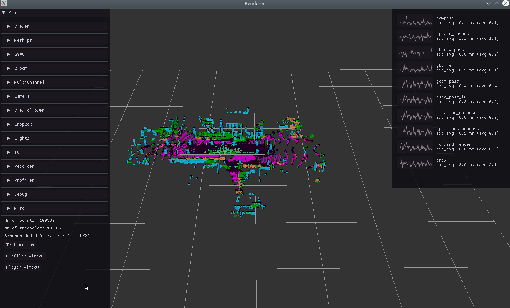

# Temporal LatticeNet

[Project Page](https://www.ais.uni-bonn.de/videos/Temporal_LatticeNet/) | [Video](https://www.youtube.com/watch?v=ljjMDkSLl0g) | [Paper](https://www.ais.uni-bonn.de/videos/Temporal_LatticeNet/ICRA_2022_Schuett.pdf)

[Abstract Flow for Temporal Semantic Segmentation on the Permutohedral Lattice](https://www.ais.uni-bonn.de/videos/Temporal_LatticeNet/)  
 [Peer Sch&uuml;tt](https://www.ais.uni-bonn.de/schuett/) <sup>1</sup>,
 [Radu Alexandru Rosu](https://www.ais.uni-bonn.de/%7Erosu/) <sup>1</sup>,
 [Sven Behnke](https://www.ais.uni-bonn.de/behnke/) <sup>1</sup>
 <br>
 <sup>1</sup>University of Bonn, Autonomous Intelligent Systems

 ## Abstract:
Semantic segmentation is a core ability required by autonomous agents, as being able to distinguish which parts of the scene belong to which object class is crucial for navigation and interaction with the environment. Approaches which use only one time-step of data cannot distinguish between moving objects nor can they benefit from temporal integration. In this work, we extend a backbone LatticeNet to process temporal point cloud data. Additionally, we take inspiration from optical flow methods and propose a new module called Abstract Flow which allows the network to match parts of the scene with similar abstract features and gather the information temporally. We obtain state-of-the-art results on the SemanticKITTI dataset that contains LiDAR scans from real urban environments.  

<p align="middle">
  
</p>

This is the official PyTorch implementation of ["Abstract Flow for Temporal Semantic Segmentation on the Permutohedral Lattice"](https://www.ais.uni-bonn.de/videos/Temporal_LatticeNet/).   

The implementation is written in CUDA and PyTorch. There is no CPU implementation yet.

This repository is based on the official [LatticeNet](http://www.ais.uni-bonn.de/videos/RSS_2020_Rosu/) implementation from Radu Alexandru Rosu: https://github.com/RaduAlexandru/lattice_net .


# Getting started 

The easiest way to install Temporal LatticeNet is using the included Dockerfile. <br/>
You will need to have Docker>=19.03 and nvidia drivers (https://github.com/NVIDIA/nvidia-docker) installed. <br/>
Afterwards, you can build the docker image which contains all the LatticeNet dependencies using:

## Docker

The *docker build (build.sh)* command will take some time, because some packages are built from scratch.

```sh
$ git clone --recursive https://github.com/AIS-Bonn/temporal_latticenet.git
$ cd temporal_latticenet/seq_docker
$ ./build.sh temporal_lattice_img
$ ./run.sh temporal_lattice_img  
$ # you need to setup your ssh key now
$ git clone --recursive https://github.com/peerschuett/easy_pbr
$ cd easy_pbr && make && cd ..
$ # tested with commit 0444e567c27220e6215e9cfca3fbb05f09fe0137
$ git clone --recursive https://github.com/RaduAlexandru/data_loaders 
$ cd data_loaders && make && cd ..
$ git clone --recursive https://github.com/peerschuett/lattice_net
$ cd lattice_net && make && cd ..
```

The folder *temporal_latticenet* is mounted during run, so that changes inside the docker are reflected to the folder. Additionally, it is recommended to mount the datasets you want to use. These options can be changed in the *run.sh*.

### SSH inside Docker

Some dependent repositories need an ssh key, because they rely on ssh cloning:

```sh
$ ssh-keygen -t ed25519 -C "your@example.com" #generate ssh key inside the docker
$ # add the ssh key to your github account
$ eval "$(ssh-agent -s)" # activate ssh agent
$ ssh-add ~/.ssh/id_ed25519  # add the key to the ssh-agent
```

## Data


Temporal LatticeNet uses point clouds for training. All clouds of a sequence need a common reference frame, and therefore poses for each cloud are needed.         
The clouds have to be placed into the folder, that can be linked using the *run.sh* script. They then appear in the docker under the path */workspace/Data/*.
All available dataloaders for the datasets can be found in the folder **dataloader**. They are implemented according to the corresponding pytorch classes (https://pytorch.org/docs/stable/data.html). 

### SemanticKITTI

Currently only [SemanticKITTI](http://www.semantic-kitti.org/) is supported. All the needed clouds can be downloaded from the competition website. 

### Paris-Lille-3D
[Paris-Lille-3D](https://npm3d.fr/paris-lille-3d) was implemented aswell, but the training was not pursued, due to problems with the dataset. 
<!--We tried to cut the Paris-Lille-3D dataset into smaller sequential point clouds, to create a SemanticKitti-like structure. This didn't work, because the scans are taken far slower than the ones from SemanticKitti and moving objects are stretched out and not recognizable.-->

# Usage


## Defining the Network

The config files (**.cfg**) in the folder *seq_config/* manage the different modes of the network. We have different ones for the training and testing.
The bool **sequence_learning** defines if the network should use temporal dependencies or not. Setting it to *false* will run a basic LatticeNet that uses only the first cloud of the sequence.
Meanwhile, **rnn_modules** is an array with four entries that defines the fusion modules at all possible positions. 
The entries can be: Linear/MaxPool/CGA/AFlow/LSTM/GRU/None. An example configuration could be 
```
model: rnn_modules: ["gru", "gru", "aflow", "aflow"]
``` 
Setting **accumulate_clouds: true** will accumulate all clouds of a sequence and use the original LatticeNet to predict the semantic segmentation. 

## Training 

LatticeNet uses config files to define the dataset parameters, the training parameters, model architecture and various visualization options.<br/>
Running the training script will by default use the config file for the SemanticKITTI dataset (**lnn_train_semantic_kitti.cfg**) and start the training.

Training the network:
```sh
$ python train_ln.py --dataset semantickitti
```

## Evaluating 

Testing works similar to the training. A major difference is, that we need to load a specific model that needs to be defined in the config file (e.g. **lnn_eval_semantic_kitti.cfg**):

```
checkpoint_path: "/workspace/temporal_latticenet/pretrained_models"
load_checkpoint_model: "12022022_0014_multi_Kitti_Ref_sigma0.6_typegru-gru-aflow-aflow_frames4_scope3_epoch2.pt"
``` 

The network would now load the pretrained model **12022022_0014_multi_Kitti_Ref_sigma0.6_typegru-gru-aflow-aflow_frames4_scope3_epoch2.pt** that can be found in the folder */workspace/temporal_latticenet/pretrained_models*. By default, it will now evaluate all clouds that are part of the *test split* of SemanticKITTI. These are all clouds from the sequences 11 to 21. 

Evaluating the network:
```sh
$ python test_ln.py --dataset semantickitti
```

### Create a submission for the SemanticKITTI competition website

To create a valid submission for the SemanticKITTI competition website, you have to follow the steps explained in *test_ln.py* in line 234 under the **IMPORTANT for competition** comment. Additionally, you need the scripts provided in the https://github.com/PRBonn/semantic-kitti-api repository. 


## Configuration options 

Various configuration options can be interesting to check out and modify. We take lnn_train_semantic_kitti.cfg as an example. 

```
core: hdpi: false          # can be turned on an off to accomodate high DPI displays. If the text and fonts in the visualizer are too big, set this option to false.
train: with_viewer: false  # setting to true will start a visualizer which displays the currently segmented point cloud and the difference to the ground truth.
train: with_wandb: false   # setting to true will log loss, IoU and gradients to wandb (https://wandb.ai).
model: use_center: false   # by default, the AFlow module only uses the one-hop neighborhood without the center vertex. Setting this to true uses the center as well.
``` 
<br/><br/>
If training is performed with the viewer enabled, you should see something like this:
<br/>
<p align="middle">
  
</p>


## Visualize the predictions

The predictions are provided as **.label** files for each cloud. These can be visualized using the **RecordPLYs.py** script, that uses **easy_pbr** to display the scenes. You can enable recording of images for each point cloud from the given camera pose using the **recorder** in the **RecordPLYs.py** script. You can view a wide variety of different clouds with this script, from ground truth segmentations and the network predictions to all clouds of a sequence in a common coordinate system.

We provide a small script **create_movie.sh** with which you can generate a mp4-video from sequentially numbered images. For the script to work, you have to navigate to the folder, where the images are located, and then call the script from there. It will then add all images in their numeric order to the video.  

To view the color map independently, we created the file **Colorscheme.ods** for SemanticKITTI in the folder *colorscheme_and_labels/semantic-kitti*. We made minor changes to the original colormap provided by the SemanticKITTI competition, because the color of the classes other-vehicle and moving-car were too similar.


## Citation

```
@inproceedings{schuett2022abstractflow,
  title={Abstract Flow for Temporal Semantic Segmentation on the Permutohedral Lattice},
  author={Sch{\"u}tt, Peer and Rosu, Radu Alexandru and Behnke, Sven},
  booktitle="Proceedings of the IEEE International Conference on Robotics and Automation (ICRA)",
  year={2022}
}
```

# License
Temporal LatticeNet is provided under the terms of the MIT license (see LICENSE). We bundle various other libraries, which may have different licenses.
